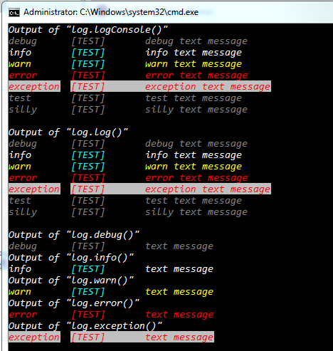

# node-logservice-db-file-console

Service for logging in nodejs projects

[](https://travis-ci.org/sven-piller/logService)
[](https://www.npmjs.com/package/node-logservice-db-file-console)
[](https://www.npmjs.com/package/node-logservice-db-file-console)
[](https://david-dm.org/sven-piller/logService)
[](https://david-dm.org/sven-piller/logService?type=dev)
[](https://coveralls.io/github/sven-piller/logService?branch=master)
[](https://raw.githubusercontent.com/sven-piller/logService/master/LICENSE)
[](https://github.com/sven-piller/logService/issues)
[](https://greenkeeper.io/)

Configurable to log via winston-mongodb to database, via winston to files and/or to console.

## TODO

- [x] Integrate base console logging
- [x] Integrate base file logging
- [ ] Integrate base mongodb logging
- [ ] Implement custom configuration
- [ ] Write tests
- [ ] Write documentation

## Install

```sh
npm install node-logservice-db-file-console --save
```

## Usage

```javascript
var log = require('node-logservice-db-file-console')(configObject);

// change custom config globally in project
log.reinit(configObject);

// log events
log.logConsole('debug text message', 'debug', '[TEST]', 'client');
log.logConsole('info text message', 'info', '[TEST]', 'client');
log.logConsole('warn text message', 'warn', '[TEST]', 'client');
log.logConsole('error text message', 'error', '[TEST]', 'client');
log.logConsole('exception text message', 'exception', '[TEST]', 'client');
log.debug('debug text message', '[TEST]', 'client');
log.info('info text message', '[TEST]', 'client');
log.warn('warn text message', '[TEST]', 'client');
log.error('error text message', '[TEST]', 'client');
log.exception('exception text message', '[TEST]', 'client');
```

### Example Output



## Tests

```sh
npm test
```

## Contributing

Feel free and contribute

## Release History

- 0.3.3 Updated Readme and Dependencies
- 0.3.0 File logging
- 0.2.0 Console logging
- 0.0.1 Initial release
